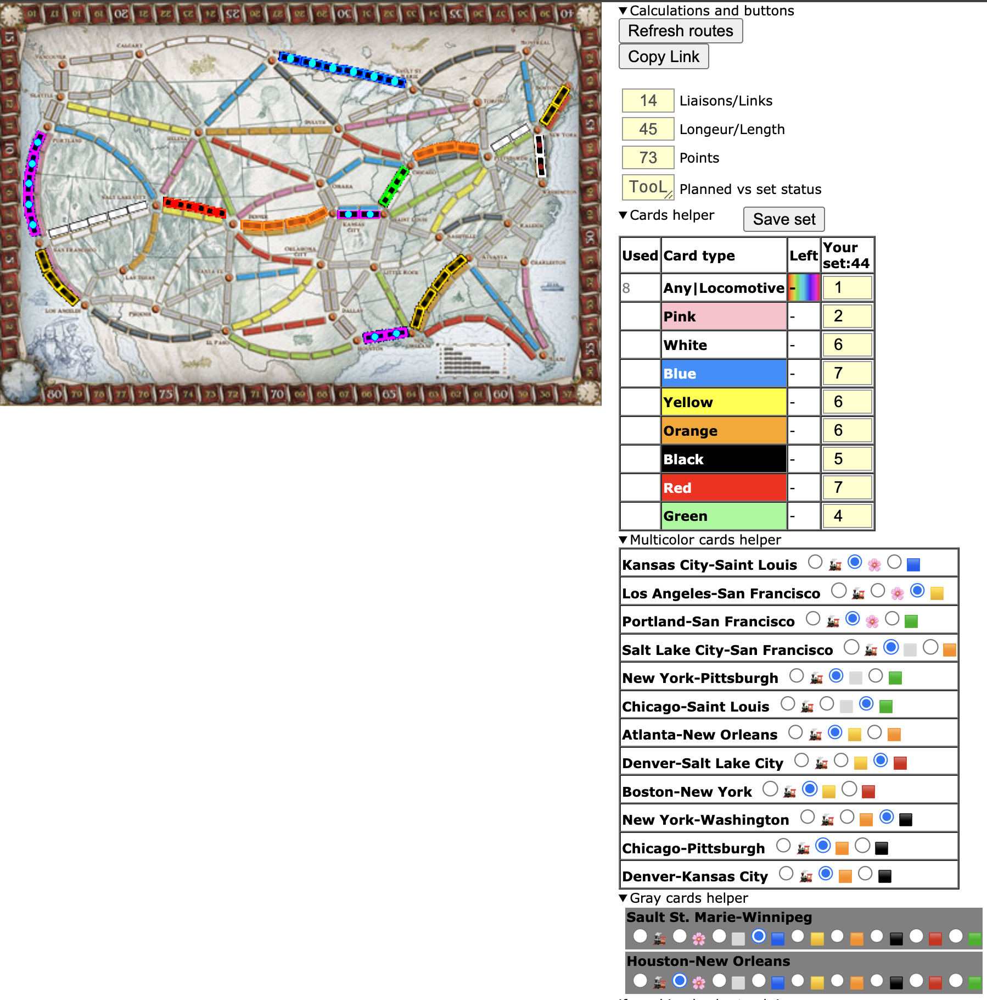

TicketToRide Simulator edited by choosen

Most recent version:
|

`TODO.list` has my future ideas.

You can enter your full setup 
by leaving color inputs and paste numbers values in new lines.

Hit setup to open new window with same color set. 
By default there is 44 seed with 6 locos and 6/4 per colors

BUGS:
1. OK STATUS is not splitting colors right into any color tracks
1. OK STATUS is not checking at all dual colors tracks

Initial version
|